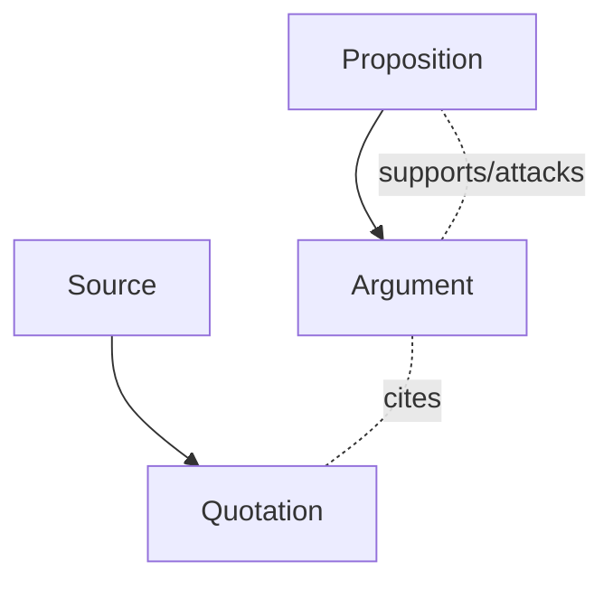

## ArguMem — Argumentative memory for LLMs

ArguMem turns unstructured text into an argument graph. It stores sources, extracts atomic quotations, and (roadmap) builds propositions and arguments on top.

### Core concepts
- **Source**: raw text with optional `context` and `title`.
- **Quotation**: atomic statement extracted from a source (optional `locator`).
- **Proposition**: normalized claim (schema present, UI/API coming).
- **Argument**: links propositions and quotations (schema present).

### Data model (high-level)


### What works today
- Add a source and automatically extract quotations via an LLM.
- Browse sources and quotations; view simple database stats.
- Propositions/arguments are scaffolded for upcoming iterations.

### Project layout
- `src/api`: FastAPI service exposing the HTTP API
- `src/argumem`: core library (extraction, repositories, schema)
- `web`: minimal React UI (Vite)

## Quickstart

Prereqs: `uv` (Python), Node 18+.

1) Run the API (needs an OpenAI API key)
```bash
export OPENAI_API_KEY=...  # or send per-request header
uv run src/api/main.py
```

2) Run the web UI
```bash
cd web && npm install && npm run dev
```

## API (essentials)

- `POST /memories`
  - Body: `{ "content": string, "context": string, "title"?: string }`
  - Auth: `X-OpenAI-API-Key` header or `OPENAI_API_KEY` env
  - Effect: stores a source and extracted quotations

- `GET /sources` · `GET /sources/{id}` · `GET /sources/{id}/quotations`
- `GET /quotations` · `GET /database/info` · `GET /recent`

Example:
```bash
curl -X POST http://localhost:8000/memories \
  -H 'Content-Type: application/json' \
  -H 'X-OpenAI-API-Key: YOUR_KEY' \
  -d '{
    "content": "A, because of B. Therefore C.",
    "context": "paper snippet",
    "title": "Example"
  }'
```

## Notes
- CORS is enabled for `http://localhost:5173` (Vite dev). API defaults to port `8000`.
- The extractor currently targets quotations; proposition/argument construction is next.