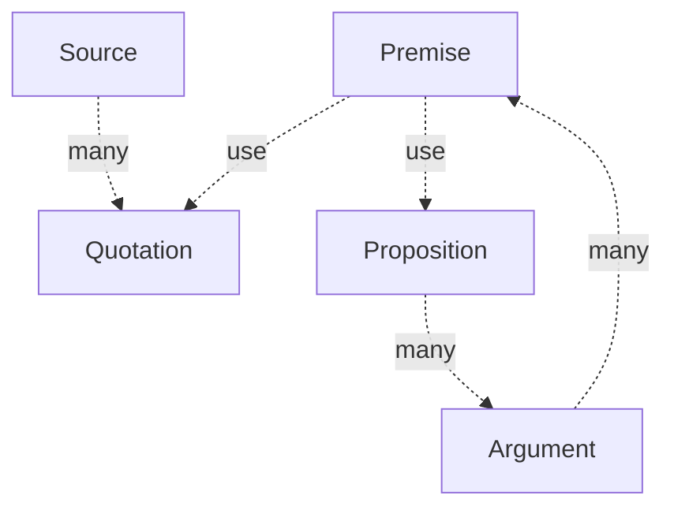

## ArguMem — Argumentative Memory for LLMs

ArguMem turns unstructured text into an argument graph. It stores sources, extracts atomic quotations, and (roadmap) builds propositions and arguments on top.

### Core concepts

- **Source**: Raw text with optional `context` and `title`.
- **Quotation**: An atomic statement extracted from a source.
    - Can be represented as `[source_type]: "[source_name]" by [author(s)] [date] claims "[quotation]"`
        - Example: `Post on X: "Self-driving soon" by Elon Musk 01.01.2050 claims: "We will have self driving soon"`.
    - Always faithful to the source (e.g., `Müller et al., 2025 claims that Schneider et al., 2010 claims that AI will likely be beneficial to humanity`).
- **Proposition**: A clear, single-sentence claim that can be true or false.
    - Can be supported or countered by multiple arguments.
    - Used in arguments to support or counter other propositions.
- **Argument**: A collection of premises (propositions or quotations) that support or counter a proposition.

### Data model (high-level)



### Core functions

The \[\[argumem.py]] file contains the `Argumem` class, which provides the following interactions:

* `add_memory`
* `get_memory`
* `check_belief`

### Project layout

* `src/argumem`: Core library
* `src/api`: FastAPI service exposing the HTTP API
* `web`: Minimal React UI (Vite)

## Quickstart (with frontend)

**Prerequisites:** `uv` (Python), Node 18+

1. Run the API:

```bash
uv run src/api/main.py
```

2. Run the web UI:

```bash
cd web && npm install && npm run dev
```